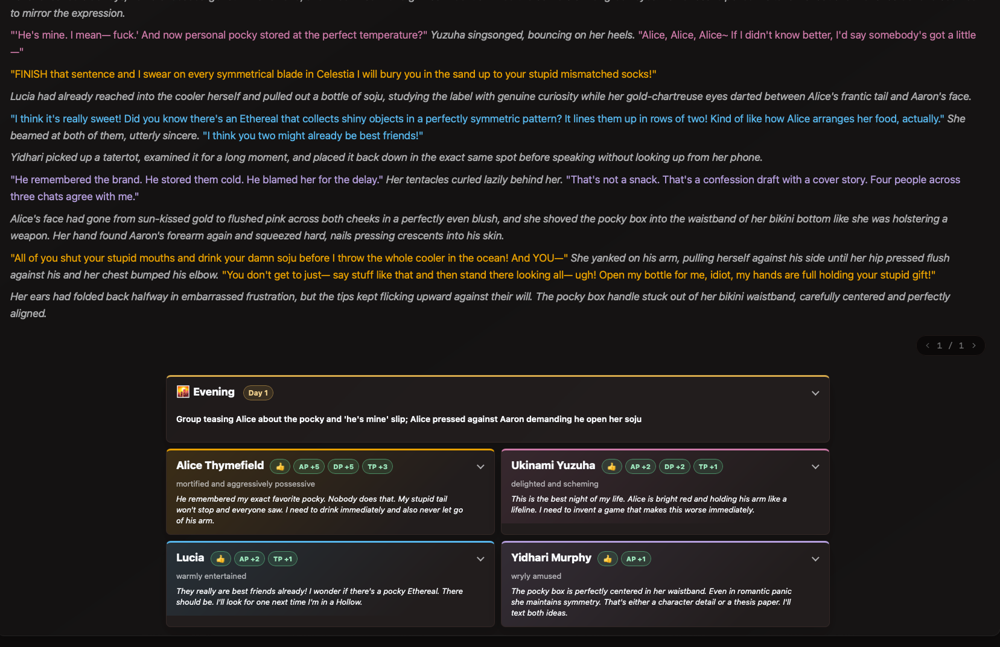
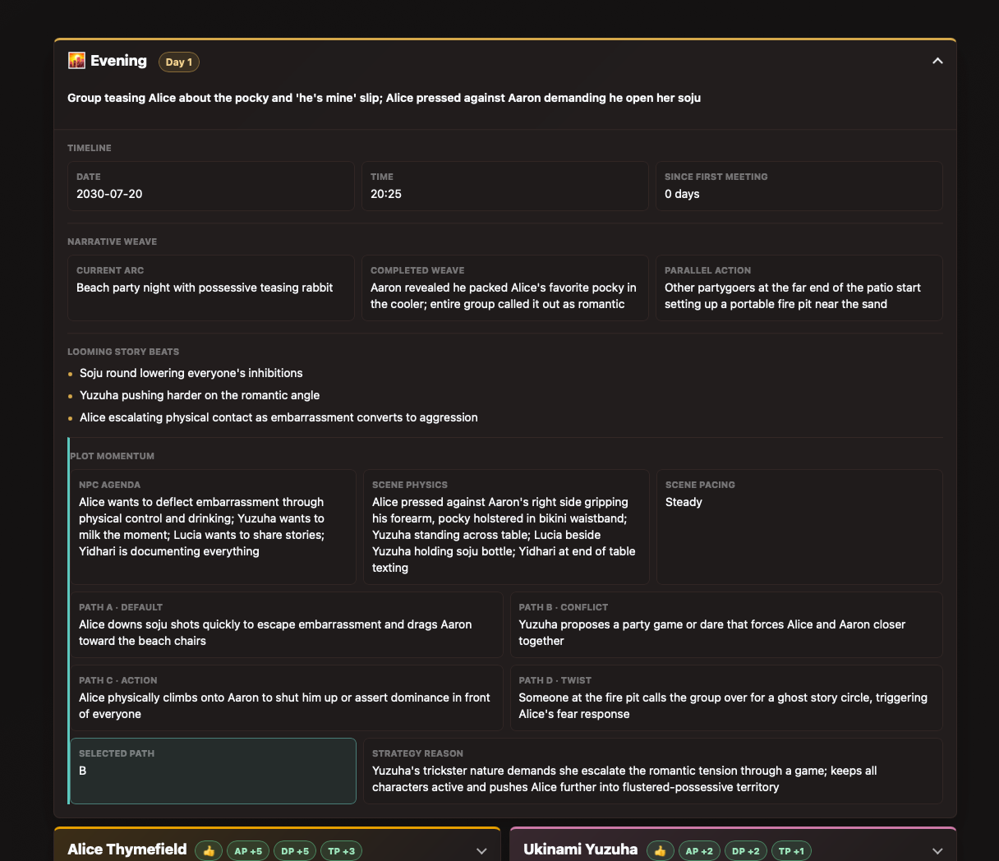
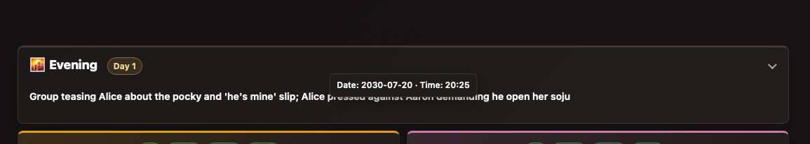
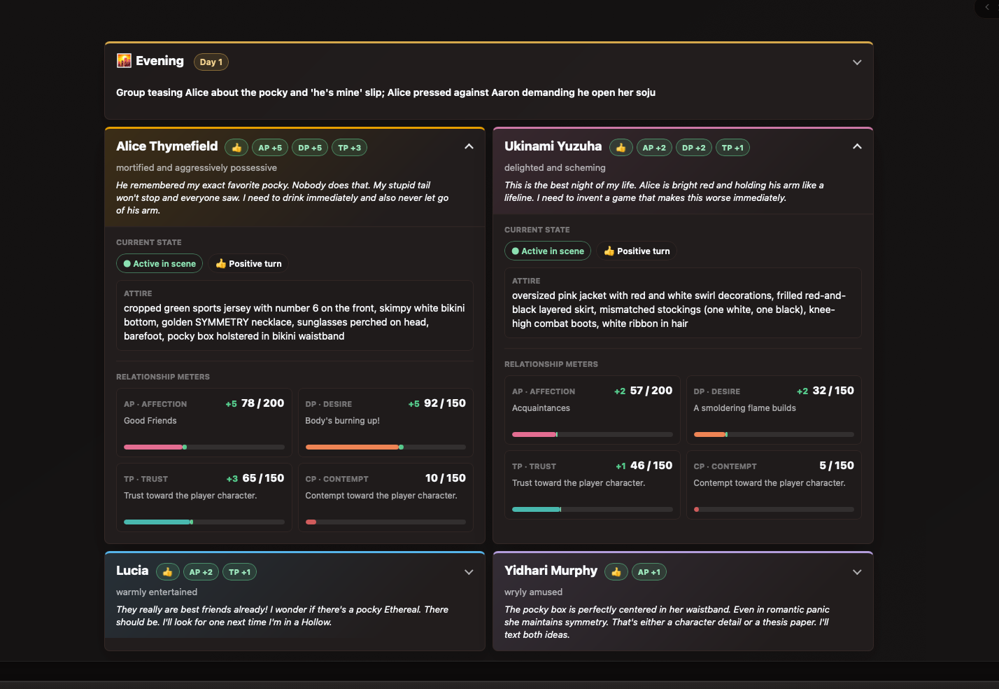
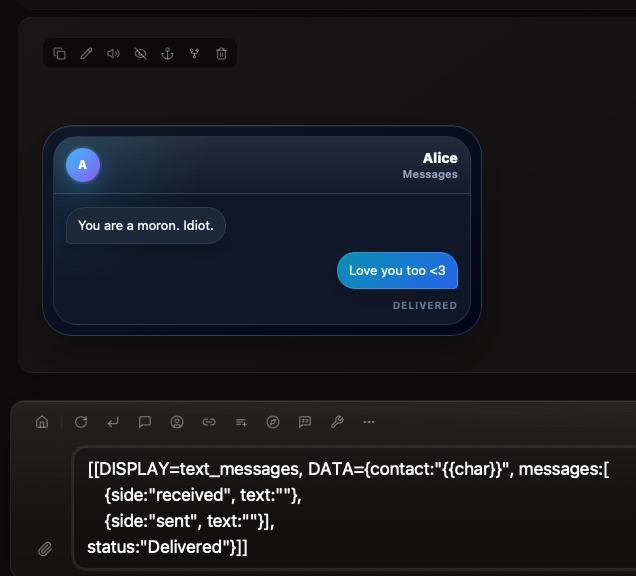
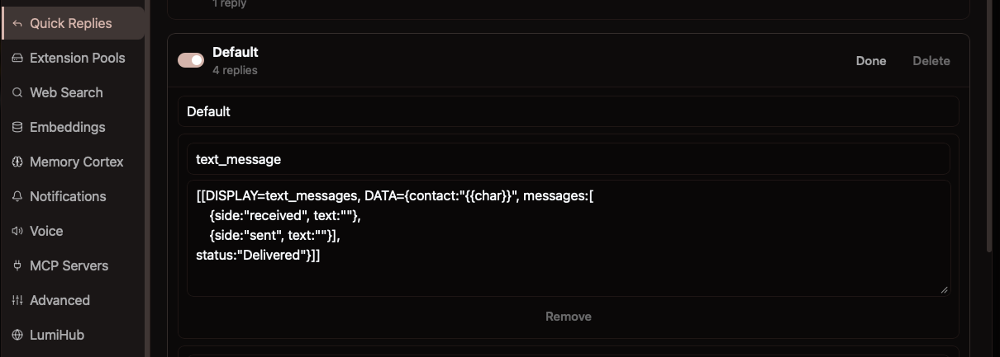

# Narrative Weave SimTracker

Narrative Weave is a scene-aware Silly Sim Tracker preset for relationship-heavy roleplay. It renders one shared world and plot panel alongside up to four color-coded NPC cards, keeping the current scene, character state, relationship movement, and likely story directions visible without exposing the raw tracker data.



## Fork required for now

> [!IMPORTANT]
> Narrative Weave currently requires the [ajrc0re fork of Lumiverse-SimTracker](https://github.com/ajrc0re/Lumiverse-SimTracker). Its single-layout, multi-character presentation depends on tracker-level rendering support proposed in [upstream PR #3](https://github.com/prolix-oc/Lumiverse-SimTracker/pull/3). Install and update from the fork until that PR is merged and included in an upstream release.

Use this repository URL in Lumiverse:

```text
https://github.com/ajrc0re/Lumiverse-SimTracker
```

The fork seeds the Narrative Weave preset automatically. You can also inspect or import the files directly:

- [Importable preset JSON](narrative-weave-simtracker.json)
- [Readable HTML template](narrative-weave-simtracker.html)

## Feature tour

### One tracker for the whole scene

Tracker-level rendering compiles the preset once with the complete `worldData` object and normalized `characters` array. That makes it possible to place one shared story panel above a coordinated grid of NPC cards instead of rendering an isolated world panel for every character.

The compact view keeps the current part of day, day counter, immediate narrative thread, NPC mood, internal thoughts, reaction, and per-turn meter changes visible at a glance. Every world and character panel uses a native collapsible disclosure, so detail is available without permanently occupying the conversation.

### Structured world continuity

Expand the world panel to see:

- Current in-world date and time.
- Day counter and days since the first meeting.
- Current narrative arc and most recently completed weave.
- Parallel action occurring elsewhere in the same reply window.
- One to three looming story beats.
- NPC agenda, exact scene positioning, and scene pacing.
- Four possible next paths: default, conflict, action, and twist.
- The selected path and the strategy behind it.



The collapsed world card also exposes its date and time through a hover or keyboard-focus tooltip.



### Character continuity and relationship movement

Each NPC card tracks:

- Stable per-character accent color.
- Active, sleeping, comatose, angry, incapacitated, or deceased state.
- Current mood and a private internal thought of up to three sentences.
- An authoritative attire list that persists until the story changes it.
- AP (Affection) on a 0–200 scale.
- DP (Desire), TP (Trust), and CP (Contempt) on 0–150 scales.
- Exact AP and DP status labels.
- Beneficial or detrimental turn reaction.
- Renderer-derived meter deltas compared with the previous tracker turn.

The compact card shows the changes that matter immediately. Expanding it reveals status chips, attire, meter values, status text, progress tracks, and highlighted gain/loss segments. The model supplies the current values; the renderer calculates the visible per-turn deltas, so the model does not need to invent change fields.



### Responsive, accessible presentation

- Two-column world and character grids on wider displays.
- Single-column layout at narrow widths.
- Native `<details>` controls for mouse, touch, and keyboard use.
- Hover and focus tooltips for timeline and meter explanations.
- Reduced-motion support through `prefers-reduced-motion`.
- Raw `<tracker type="sim">` data hidden from the visible chat while the rendered tracker remains in place.
- A maximum of four active character cards to keep the layout readable.

### NPC-focused narrative guardrails

The preset prompt keeps the human-controlled player out of the NPC tracker array. It maintains NPC goals independently from the player, records physical scene continuity, and proposes future NPC or environment actions without predicting or forcing the user's next action.

## Inline text-message display

Narrative Weave includes an enabled `text_messages` inline display. It turns lightweight display markup into an in-world phone or chat thread with:

- Received and sent message bubbles.
- Contact or group name.
- Optional app/device label and header time.
- Optional delivery/read status.
- Optional typing indicator.
- Optional thread context.
- Optional avatar accent color.
- Optional sender, time, or reaction metadata on individual messages.



### Quick Reply setup

Create a Lumiverse Quick Reply named `text_message` and paste this content exactly:

```text
[[DISPLAY=text_messages, DATA={contact:"{{char}}", messages:[
    {side:"received", text:""},
    {side:"sent", text:""}],
status:"Delivered"}]]
```



Use the Quick Reply as a scaffold: fill in the two `text` values, add or remove message objects as needed, and keep each `side` set to either `received` or `sent`.

For example:

```text
[[DISPLAY=text_messages, DATA={contact:"Alice", messages:[
    {side:"received", text:"You are a moron. Idiot."},
    {side:"sent", text:"Love you too <3"}],
status:"Delivered"}]]
```

Optional thread-level fields can be added alongside `contact`, `messages`, and `status`:

```text
device:"Messages",
time:"8:42 PM",
typing:"Alice",
context:"Beach party",
accent:"#56B4E9"
```

Individual message objects may also include `sender`, `time`, or `reaction`.

## Installation and use

1. In Lumiverse, open **Extensions** and install or update from `https://github.com/ajrc0re/Lumiverse-SimTracker`.
2. Open the Silly Sim Tracker settings.
3. Choose **Narrative Weave SimTracker** from the template selector.
4. Click **Save Settings**.
5. Enable or use `{{sim_tracker}}` wherever your character or scenario setup normally injects the active tracker prompt.
6. Optionally create the `text_message` Quick Reply shown above.

The fork seeds `custom/narrative-weave-simtracker.json` into template storage during installation and updates the same preset when a newer bundled revision is available. If the preset does not appear, use **Import Preset** and select the JSON file manually.

## Tracker data at a glance

Narrative Weave consumes the canonical tracker tag used by Silly Sim Tracker:

```xml
<tracker type="sim">
{
  "worldData": {
    "current_date": "2030-07-20",
    "current_time": "20:25",
    "part_of_day": "🌇 Evening",
    "day_counter": 1,
    "immediate_narrative_thread": "The urgent active scene thread",
    "looming_story_beats": ["A consequence or upcoming pressure"],
    "current_narrative_arc": "The current primary story focus",
    "completed_weave": "The most recently resolved beat",
    "parallel_actions": "A simultaneous off-scene event",
    "plot_momentum": {
      "npc_agenda": "Immediate NPC goals",
      "physics": "Current locations and positioning",
      "scene_pacing": "Steady",
      "next_path_options": {
        "path_a_default": "The most obvious next NPC action",
        "path_b_conflict": "NPC-created friction",
        "path_c_action": "Physical or environmental escalation",
        "path_d_twist": "An unexpected change"
      },
      "selected_path": "B",
      "strategy_reason": "Why this path serves the NPCs and pacing"
    }
  },
  "characters": [
    {
      "name": "Alice",
      "mood": "guardedly affectionate",
      "inactive": false,
      "inactive_reason": 0,
      "internal_thought": "A private thought.",
      "attire": "Current complete attire.",
      "bg": "E69F00",
      "reaction": 1,
      "ap": 78,
      "ap_status": "Good Friends",
      "dp": 92,
      "dp_status": "Body's burning up!",
      "tp": 65,
      "cp": 10
    }
  ]
}
</tracker>
```

Both `E69F00` and `#E69F00` color forms are accepted. JSON and YAML payloads are supported by the extension, although the preset's generated format uses JSON.
